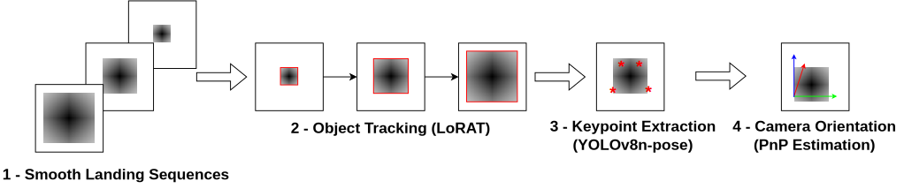

# Vision-based Landing Guidance through Tracking and Orientation Estimation

Official evaluation and testing pipeline for the **WACV 2025** paper: *Vision-based Landing Guidance through Tracking and Orientation Estimation*. 

This repository contains the complete pipeline for running and evaluating the proposed method using the **LARD V1 synthetic dataset**. It includes tools for sequence generation, single-image geometric validation, full sequence tracking, and comprehensive statistical evaluation.

|  |
|:--:| 
| *Main steps from our pipeline: LoRAT Tracking → YOLO Keypoints → PnP Pose Estimation* |

---

## 🛠️ Installation & Setup

You can run this project on either a **CPU** or a **GPU (CUDA)**. A GPU is highly recommended for running the full pipeline (LoRAT + YOLO) at reasonable speeds, but all evaluation and geometric tests will work perfectly on a CPU.

### 1. Clone the Repository
```bash
git clone https://github.com/jpklock2/vision-based-landing-guidance.git
cd vision-based-landing-guidance
git submodule update --init --recursive
```

If you are using LoRAT, apply the dataset adaptation replacements:
```bash
./replace_files.sh
```

### 2. Environment Setup

It is recommended to use a Python virtual environment (Python 3.8+).
```bash
python -m venv venv
source venv/bin/activate  # On Windows: venv\Scripts\activate
```

#### Option A: GPU Setup (CUDA)
If you have an NVIDIA GPU, install PyTorch with CUDA support to dramatically speed up YOLO and LoRAT models:
```bash
# Install PyTorch with CUDA (Check pytorch.org for your specific CUDA version)
pip install torch torchvision --index-url https://download.pytorch.org/whl/cu118

# Install project dependencies
pip install -r requirements.txt
pip install -r LoRAT/requirements.txt
```

#### Option B: CPU-Only Setup
If you do not have a GPU, install the CPU-only version of PyTorch. The geometric and Ground Truth (GT) evaluation scripts will run instantly, though the `yolo` and `full_pipeline` modes will be slower.
```bash
# Install PyTorch for CPU
pip install torch torchvision --index-url https://download.pytorch.org/whl/cpu

# Install project dependencies
pip install -r requirements.txt
pip install -r LoRAT/requirements.txt
```

---

## 📂 Dataset & Models Configuration

### 1. Pretrained Models
Download the pretrained models from the paper's link and place them in the `models/` directory:
```text
models/
├── keypoints/
│   └── model.pt       # Fine-tuned YOLOv8n-pose model
└── tracking/
    └── model.bin      # LoRAT tracking weights
```

### 2. LARD V1 Synthetic Dataset
Download the **LARD_test_synth** dataset and place it in the project root:
```text
LARD_test_synth/
├── LARD_test_synth.csv       # Main metadata CSV file
├── images/                   # All 2448x2648 runway images
└── infos.md
```

---

## 🚀 Usage & Scripts

This repository provides four main scripts for testing and evaluation. Here is a detailed breakdown of what they do and how to use them.

### 1. `evaluate.py` (Full Dataset Evaluation)
This script runs the pose estimation pipeline across the **entire LARD V1 test dataset** (2200+ images) and computes comprehensive statistics (Mean, Standard Deviation, Median, Min, Max) for Yaw, Pitch, Roll, and Slant Distance errors. It generates CSV reports and Matplotlib error distribution plots.

**Modes:**
- `gt`: Uses Ground Truth bounding boxes and corners directly from the CSV (Requires NO models, very fast).
- `yolo`: Uses YOLO to detect keypoints inside GT crops (Requires YOLO model).

**Commands:**
```bash
# Evaluate using Ground Truth corners (CPU/GPU)
python evaluate.py --method gt --csv_path LARD_test_synth/LARD_test_synth.csv

# Evaluate using YOLO model predictions (GPU recommended)
python evaluate.py --method yolo \
    --csv_path LARD_test_synth/LARD_test_synth.csv \
    --lard_images_dir LARD_test_synth/ \
    --yolo_model models/keypoints/model.pt

# Evaluate specific airports only
python evaluate.py --method gt --csv_path LARD_test_synth/LARD_test_synth.csv --airports CYYZ CYUL
```

### 2. `generate_sequence.py` (Sequence Preparation)
LARD provides images individually. To test continuous tracking (LoRAT), we must group these images into sequential approach videos. This script parses the dataset, groups images by scenario, sorts them by distance (far to near), and generates standard tracking sequences with `groundtruth.txt` files.

**Command:**
```bash
python generate_sequence.py \
    --csv_path LARD_test_synth/LARD_test_synth.csv \
    --lard_images_dir LARD_test_synth/ \
    --output_dir inputs/
```
*Outputs are saved to `inputs/<scenario_name>/`.*

### 3. `test_sequence.py` (Sequence Testing)
Tests a specific generated sequence. It features three different modes of increasing complexity.

**Modes:**
- `geometric`: A purely mathematical validation of the PnP solver. It projects 3D runway corners to 2D using ground truth poses, feeds them back into PnP, and validates that the angle errors are `< 0.001°`. (No data needed).
- `gt_keypoints`: Runs PnP across a sequence using perfect GT corners to isolate and measure the mathematical error introduced by pixel rounding.
- `full_pipeline`: Runs the complete end-to-end paper pipeline: **LoRAT Tracker → YOLO Keypoints → PnP Solver**.

**Commands:**
```bash
# 1. Geometric Math Validation
python test_sequence.py --mode geometric --airport CYUL --runway 06L --num_frames 50

# 2. Ground Truth Sequence Test
python test_sequence.py --mode gt_keypoints --sequence_dir inputs/CYYZ_05_35

# 3. Full Pipeline End-to-End Test
python test_sequence.py --mode full_pipeline \
    --sequence_dir inputs/CYYZ_05_35 \
    --yolo_model models/keypoints/model.pt
```

### 4. `test_single_image.py` (Debugging & Visualization)
Used for debugging the pipeline on a single image. It visualizes the detected keypoints overlaid on the runway image.

**Commands:**
```bash
python test_single_image.py --mode gt \
    --csv_path LARD_test_synth/LARD_test_synth.csv \
    --image_index 0 \
    --visualize
```

---

## 🧠 Core Functions Architecture

If you want to modify the code, here are the key functions driving the mathematical logic:

- **`lard_corners_to_6kp()`**: The core translation function. LARD provides 4 runway corners (A, B, C, D). PnP requires 6 points. This function calculates the midpoints of the near and far runway edges and structures the 6 points into the specific array layout expected by the system.
- **`build_3d_object_points(aspect_ratio)`**: Constructs the 3D real-world coordinates of the runway (normalized to 1.0) using the runway's specific aspect ratio dynamically loaded from `runway_data.csv`.
- **`find_runway_params()`**: Robustly matches the current airport/runway string against the database to fetch the exact physical width, aspect ratio, and yaw offset of the runway.
- **`estimate_pose_single()`**: The core mathematical engine. It takes the 6 pixel coordinates and the 3D object points, executes `cv2.solvePnP` using camera intrinsics, converts the resulting rotation vectors to Euler angles, and applies coordinate transformations (adding yaw offsets, normalizing roll, scaling slant distance to Nautical Miles).

---
*For any issues with dataset paths or model loading, ensure all directory structures exactly match the ones specified in the Configuration section.*
